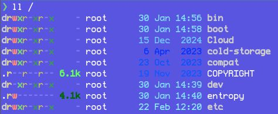

This repository contains for setting [MSX](https://en.wikipedia.org/wiki/MSX)-like colorsceme via X resources mechanism.

## Usage

Copy `MSX-resources` file somewhere; for example, to `~/.config/` directory. Then include it in your `~/.Xresources` file:

```Xresources
#include ".config/MSX-resources"
```

After that, run `xrdb` to apply changes:

```sh
xrdb ~/.Xresources
```

Now, if you start, say, `xterm`, it should use MSX-like colors.


